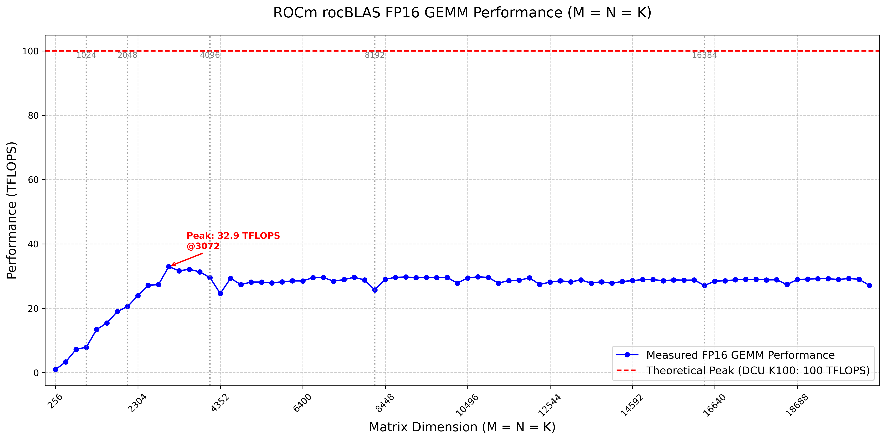
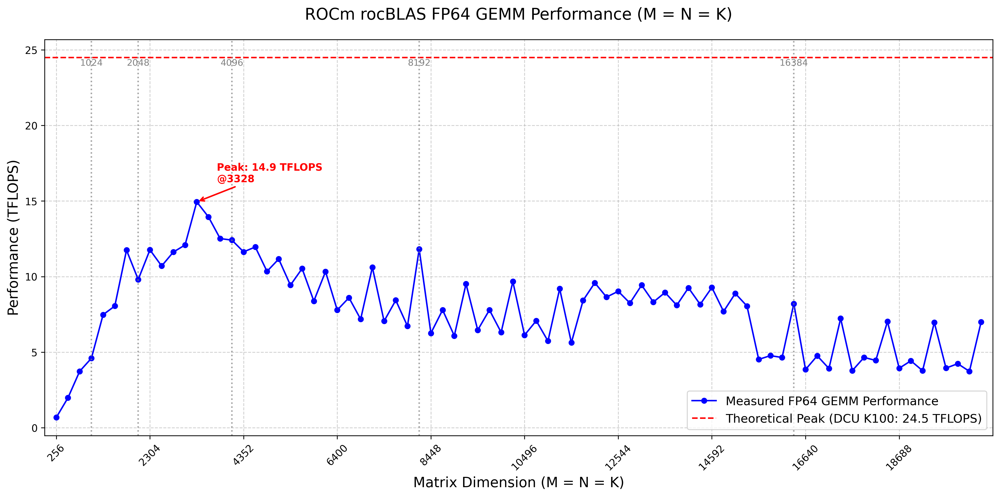
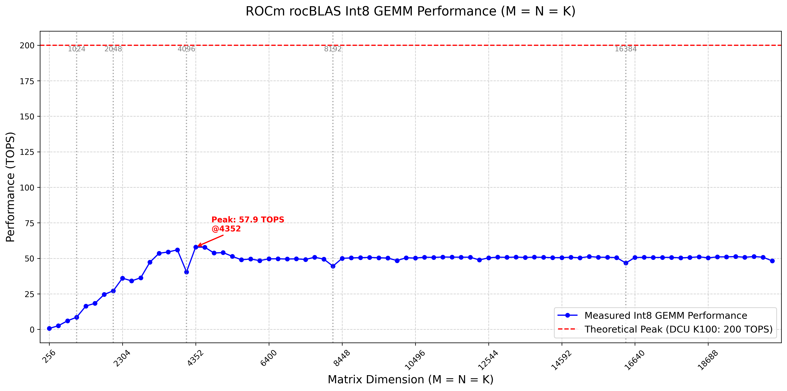
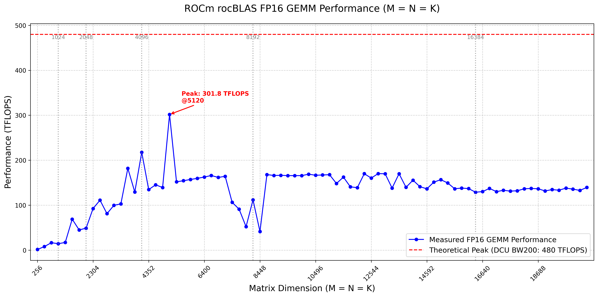
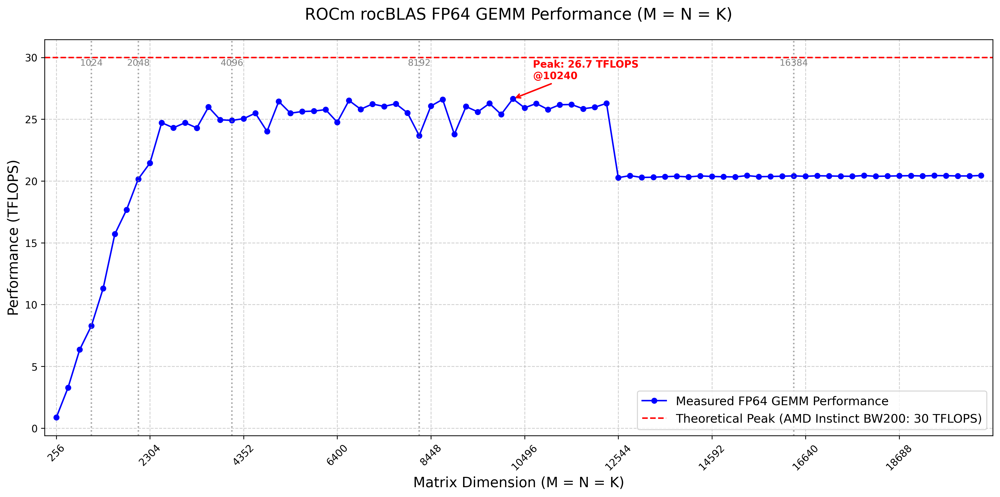
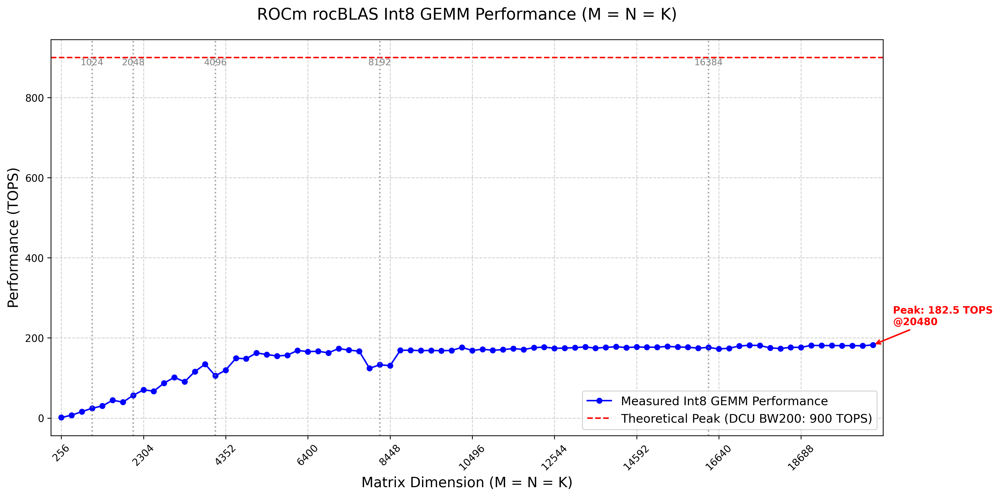
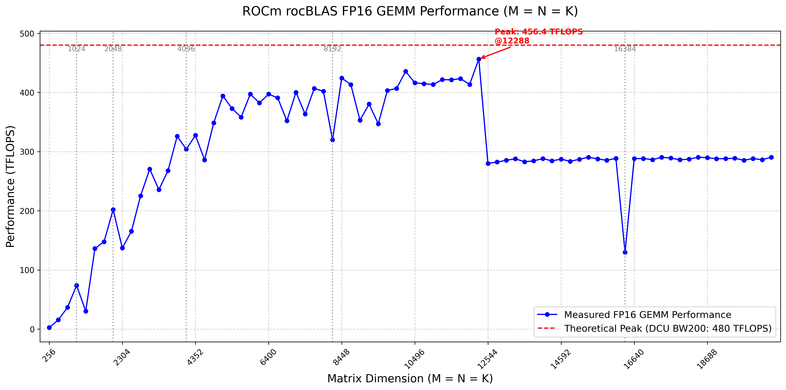
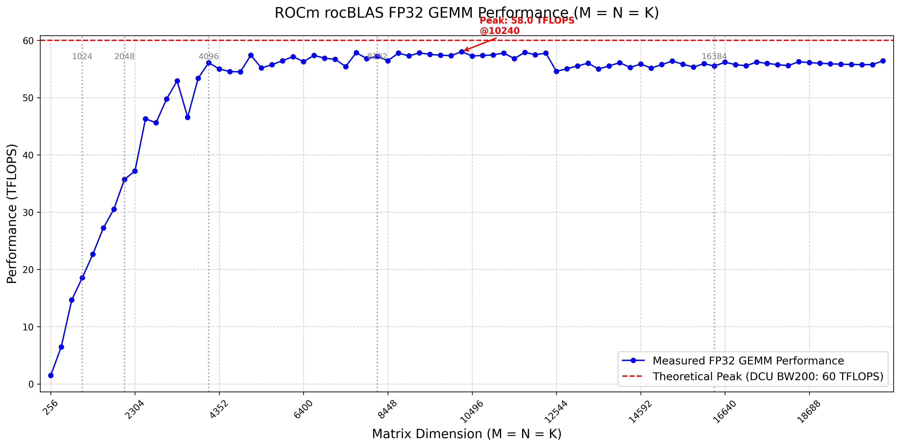
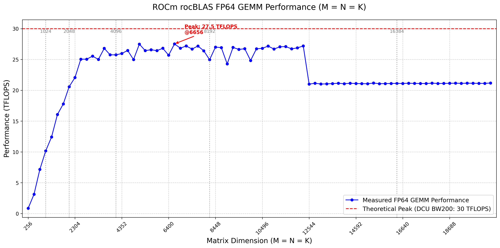
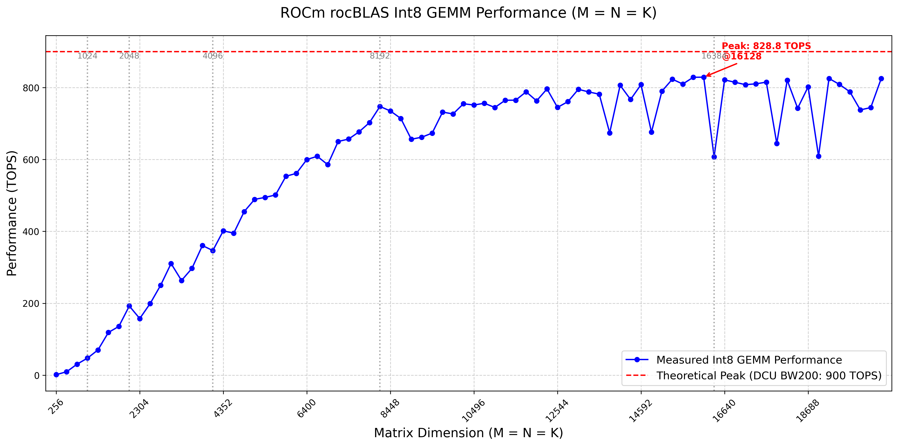

# DCU-bench

#### metrics analysis

下面列出具体的DCU K100、K100 AI、BW200官方的算力参数规格比较。

| 产品型号      | K100                        | K100 AI    | BW200     |
| ------------- | --------------------------- | ---------- | --------- |
| 架构名称      | 深算一号                    | 深算二号   | 深算三号  |
| gfx           | 916                         | 926        | 936       |
| Compute Units | 120                         | 120        | NA        |
| FP64          | 24.5TFLOPS（No VectorCore） | 24.5TFLOPS | 30TFLOPS  |
| FP32          | 24.5TFLOPS（No VectorCore） | 49TFLOPS   | 60TFLOPS  |
| TF32          | NA                          | 98TFLOPS   | 240TFLOPS |
| BF16          | NA                          | 196TFLOPS  | 480TFLOPS |
| FP16          | 100TFLOPS（No VectorCore）  | 196TFLOPS  | 480TFLOPS |
| INT8          | 200TOPS（No VectorCore）    | 392TOPS    | 960TOPS   |
| GPU Memory    | 64GB                        | 64GB       | 64GB      |
| GPU Memory BW | NA                          | 896GB/s    | 1.6TB/s   |

#### rocblas测试

[rocblas_gemm_performance_half_K100.csv](csv/rocblas_gemm_performance_half_K100.csv)是在DCU K100架构（架构gfx916）下half的执行性能。实测half峰值性能为32.9TFlops，大约为理论峰值100 TFlops的32.9%。  
[rocblas_gemm_performance_float_K100.csv](csv/rocblas_gemm_performance_float_K100.csv)是在DCU K100架构（架构gfx916）下float的执行性能。实测float峰值性能为19.1TFlops，大约为理论Matrix峰值24.5 TFlops的77.9%。  

[rocblas_gemm_performance_fp64_K100.csv](csv/rocblas_gemm_performance_fp64_K100.csv)是在DCU K100架构（架构gfx916）下double的执行性能。实测double峰值性能为14.9TFlops，大约为理论Matrix峰值24.5 TFlops的60.8%。  
[rocblas_gemm_performance_int8_K100.csv](csv/rocblas_gemm_performance_int8_K100.csv)是在DCU K100架构（架构gfx916）下int8的执行性能。实测int8峰值性能为57.9TOps，大约为理论Matrix峰值200 TOps的28.9。

[rocblas_gemm_performance_half_bw200.csv](csv/rocblas_gemm_performance_half_bw200.csv)是在DCU bw200架构（架构gfx936）下half的执行性能。实测half峰值性能为301.8TFlops，大约为理论峰值480 TFlops的62.8%。 
[rocblas_gemm_performance_float_bw200.csv](csv/rocblas_gemm_performance_float_bw200.csv)是在DCU bw200架构（架构gfx936）下float的执行性能。实测float峰值性能为56.0TFlops，大约为理论Matrix峰值60 TFlops的93.3%。
[rocblas_gemm_performance_fp64_bw200.csv](csv/rocblas_gemm_performance_fp64_bw200.csv)是在DCU bw200架构（架构gfx936）下float的执行性能。实测double峰值性能为26.7TFlops，大约为理论Matrix峰值30 TFlops的89%。  
[rocblas_gemm_performance_int8_bw200.csv](csv/rocblas_gemm_performance_int8_bw200.csv)是在DCU bw200架构（架构gfx936）下int8的执行性能。实测int8峰值性能为182.5TOps，大约为理论Matrix峰值960 TOps的19%。

Improve BW200 sclk frequency
[rocblas_gemm_performance_half_BW200.csv](csv/rocblas_gemm_performance_half_BW200.csv)是在DCU bw200架构（架构gfx936）下half的执行性能。实测half峰值性能为456.4TFlops，大约为理论峰值480 TFlops的95.1%。 
[rocblas_gemm_performance_float_BW200.csv](csv/rocblas_gemm_performance_float_BW200.csv)是在DCU bw200架构（架构gfx936）下float的执行性能。实测float峰值性能为58.0TFlops，大约为理论Matrix峰值60 TFlops的96.6%。
[rocblas_gemm_performance_fp64_BW200.csv](csv/rocblas_gemm_performance_fp64_BW200.csv)是在DCU bw200架构（架构gfx936）下float的执行性能。实测double峰值性能为27.5TFlops，大约为理论Matrix峰值30 TFlops的91.6%。  
[rocblas_gemm_performance_int8_BW200.csv](csv/rocblas_gemm_performance_int8_BW200.csv)是在DCU bw200架构（架构gfx936）下int8的执行性能。实测int8峰值性能为182.5TOps，大约为理论Matrix峰值960 TOps的86.3%。

#### 下面是不同平台在不同测试规模下执行rocblas gemm的实际Performance

DCU K100 Half Precision Gemm

DCU K100 Float Precision Gemm

DCU K100 Double Precision Gemm

DCU K100 Int8 Precision Gemm

DCU BW200 Half Precision Gemm

DCU BW200 Float Precision Gemm

DCU BW200 Double Precision Gemm

DCU BW200 Int8 Precision Gemm

##### 提升频率等级BW200执行rocblas gemm的实际Performance

DCU BW200 Half Precision Gemm

DCU BW200 Float Precision Gemm

DCU BW200 Double Precision Gemm

DCU BW200 Int8 Precision Gemm
