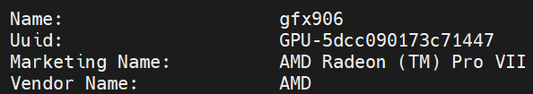
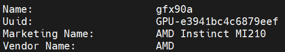
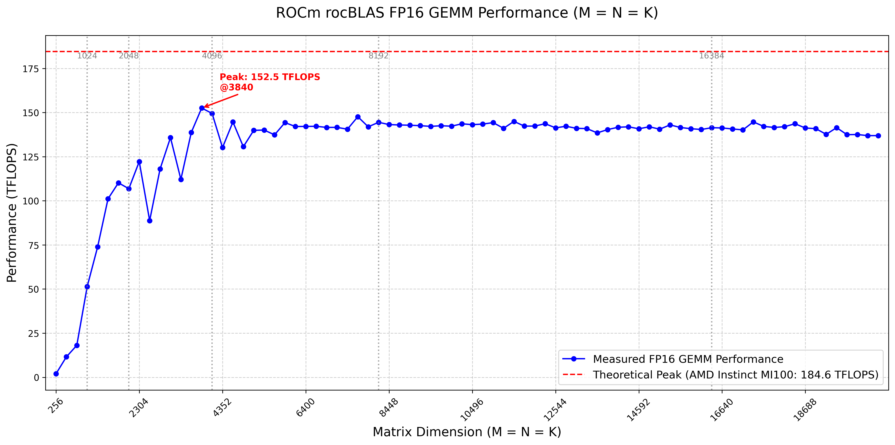
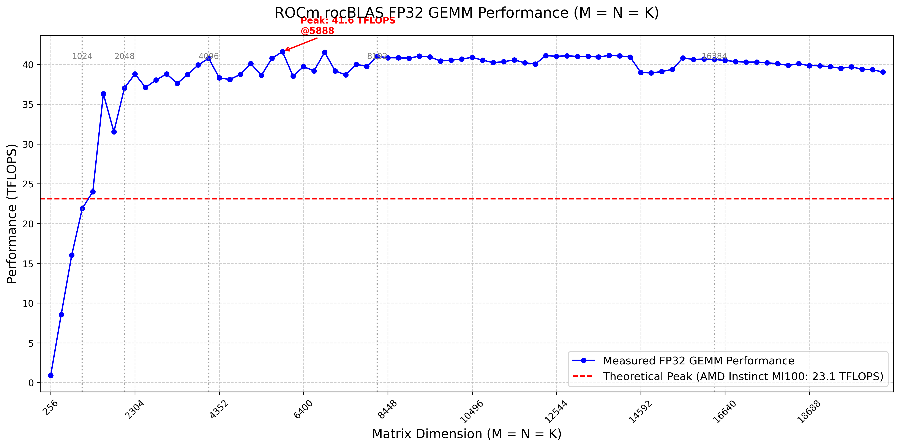
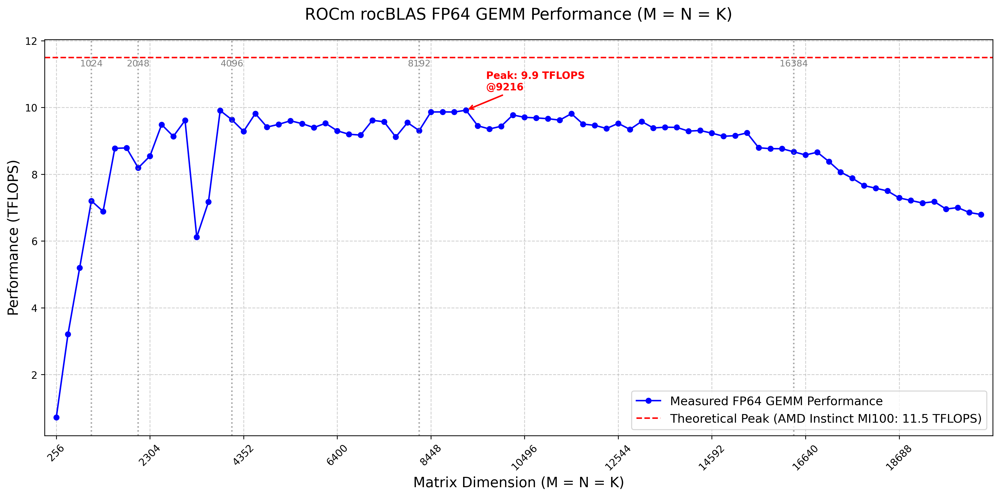
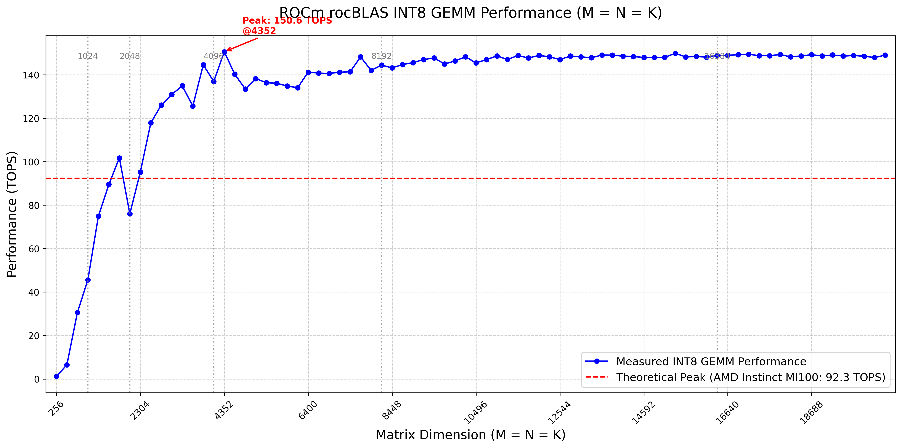
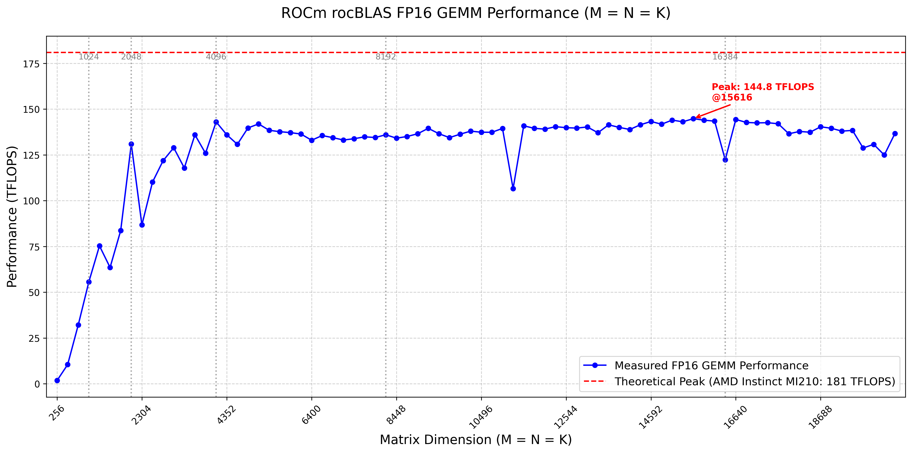
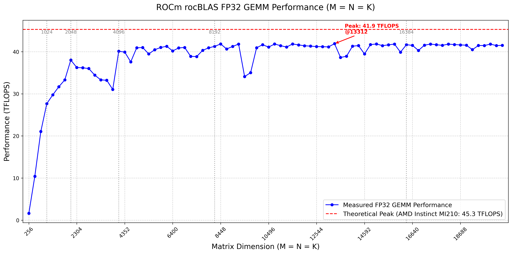
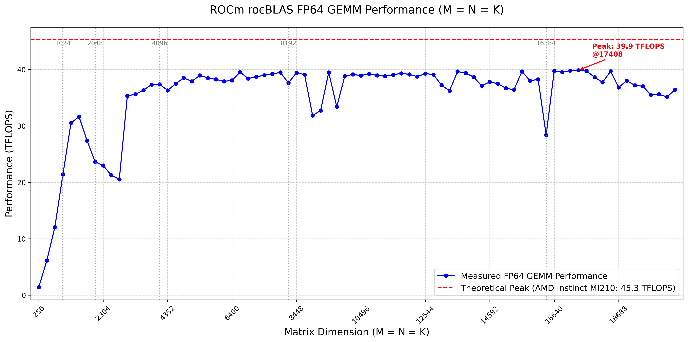
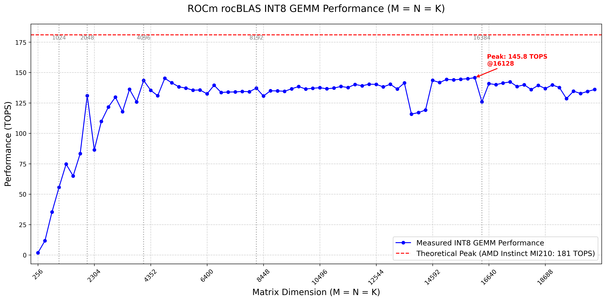

# hblas-bench & rocBLAS-bench

测试的AMD GPU型号如下：

AMD Radeon (TM) Pro VII  
  
AMD MI100  
  
AMD MI210  
  

#### metrics analysis

下面列出具体的AMD Radeon ProVII、AMD MI100、AMD MI210官方的GPUs规格比较。

| GPU Features                                        | Radeon ProVII   | MI100        | MI210           |
| --------------------------------------------------- | --------------- | ------------ | --------------- |
| GPU Architecture                                    | Vega20          | CDNA         | CDNA2           |
| Stream Processors                                   | 3,840           | 7,680        | 6,656           |
| Compute Units                                       | 60              | 120          | 104             |
| Peak Engine Clock                                   | 1725 MHz        | 1502 MHz     | 1700 MHz        |
| **Peak Half Precision (FP16) Performance**          | 26.5 TFLOPs | 184.6 TFLOPs | 181 TFLOPs  |
| **Peak Single Precision Matrix (FP32) Performance** | NA          | 23.1 TFLOPs  | 45.3 TFLOPs |
| **Peak Single Precision (FP32) Performance**        | 13.3 TFLOPs | 23.1 TFLOPs  | 22.6 TFLOPs |
| **Peak Double Precision Matrix (FP64) Performance** | NA          | NA           | 45.3 TFLOPs |
| **Peak Double Precision (FP64) Performance**        | 6.6 TFLOPs  | 11.5 TFLOPs  | 22.6 TFLOPs |
| **Peak INT4 Performance**                           | NA          | 92.3 TOPs    | 181 TOPs    |
| **Peak INT8 Performance**                           | 53 TOPs     | 92.3 TOPs    | 181 TOPs    |
| **Peak bfloat16**                                   | NA          | 92.3 TFLOPs  | 181 TFLOPs  |
| **Memory Size**                                     | 16 GB       | 32 GB        | 64GB        |
| **Peak Memory Bandwidth**                           | 1 TB/s      | 1.2 TB/s     | 1.6TB/s     |

测试half类型(半精度)和float类型(单精度)gemm结果说明如下：

[hipblas_gemm_performance_half_Radeon (TM) Pro VII.csv](csv/hipblas_gemm_performance_half_Radeon(TM)ProVII.csv)是在AMD Radeon (TM) Pro VII架构（架构gfx906，与MI50相同）下half的执行性能。实测half峰值性能为12.2 TFlops，大约为理论峰值26.5 TFlops的46%。  
[hipblas_gemm_performance_float_Radeon (TM) Pro VII.csv](csv/hipblas_gemm_performance_float_Radeon(TM)ProVII.csv)是在AMD Radeon (TM) Pro VII架构（架构gfx906，与MI50相同）下float的执行性能。实测float峰值性能为11.5TFlops，大约为理论峰值13.3 TFlops的86.5%。  
[hipblas_gemm_performance_half_MI100.csv](csv/hipblas_gemm_performance_half_MI100.csv)是在AMD MI100架构（架构gfx908）下half的执行性能。实测half峰值性能为132TFlops，大约为理论峰值184.6 TFlops的71.5%。  
[hipblas_gemm_performance_float_MI100.csv](csv/hipblas_gemm_performance_float_MI100.csv)是在AMD MI100架构（架构gfx908）下float的执行性能。实测float峰值性能为41.7TFlops，大约为理论Matrix峰值23.1 TFlops的???。  
[hipblas_gemm_performance_half_MI210.csv](csv/hipblas_gemm_performance_half_MI210.csv)是在AMD MI210架构（架构gfx90a）下half的执行性能。实测half峰值性能为133.3TFlops，大约为理论峰值181 TFlops的73.6%。  
[hipblas_gemm_performance_float_MI210.csv](csv/hipblas_gemm_performance_float_MI210.csv)是在AMD MI210架构（架构gfx90a）下float的执行性能。实测float峰值性能为41.3TFlops，大约为理论Matrix峰值45.3 TFlops的91.2%。  

#### rocblas测试

[rocblas_gemm_performance_half_Radeon (TM) Pro_VII.csv](csv/rocblas_gemm_performance_half_Radeon(TM)ProVII.csv)是在AMD Radeon (TM) Pro VII架构（架构gfx906，与MI50相同）下half的执行性能。实测half峰值性能为18.9 TFlops，大约为理论峰值26.5 TFlops的71.3%。  
[rocblas_gemm_performance_float_Radeon (TM) Pro VII.csv](csv/rocblas_gemm_performance_float_Radeon(TM)ProVII.csv)是在AMD Radeon (TM) Pro VII架构（架构gfx906，与MI50相同）下float的执行性能。实测float峰值性能为11.5TFlops，大约为理论峰值13.3 TFlops的86.5%。  
[rocblas_gemm_performance_fp64_Radeon (TM) Pro VII.csv](csv/rocblas_gemm_performance_fp64_Radeon(TM)ProVII.csv)是在AMD Radeon (TM) Pro VII架构（架构gfx906，与MI50相同）下double的执行性能。实测double峰值性能为5.6TFlops，大约为理论峰值6.6 TFlops的84.8%。  
[rocblas_gemm_performance_int8_Radeon (TM) Pro VII.csv](csv/rocblas_gemm_performance_int8_Radeon(TM)ProVII.csv)是在AMD Radeon (TM) Pro VII架构（架构gfx906，与MI50相同）下int8的执行性能。实测int8峰值性能为5.7TOps，大约为理论峰值53 TOps的10.7% ???。  
[rocblas_gemm_performance_half_MI100.csv](csv/rocblas_gemm_performance_half_MI100.csv)是在AMD MI100架构（架构gfx908）下half的执行性能。实测half峰值性能为132TFlops，大约为理论峰值184.6 TFlops的82.6%。  
[rocblas_gemm_performance_float_MI100.csv](csv/rocblas_gemm_performance_float_MI100.csv)是在AMD MI100架构（架构gfx908）下float的执行性能。实测float峰值性能为41.6TFlops，大约为理论Matrix峰值23.1 TFlops的???。  
[rocblas_gemm_performance_fp64_MI100.csv](csv/rocblas_gemm_performance_fp64_MI100.csv)是在AMD MI100架构（架构gfx908）下double的执行性能。实测double峰值性能为9.9TFlops，大约为理论Matrix峰值11.5 TFlops的???。  
[rocblas_gemm_performance_int8_MI100.csv](csv/rocblas_gemm_performance_int8_MI100.csv)是在AMD MI100架构（架构gfx908）下int8的执行性能。实测int8峰值性能为150.6TOps，大约为理论Matrix峰值92.3 TOps的???。  

[rocblas_gemm_performance_half_MI210.csv](csv/rocblas_gemm_performance_half_MI210.csv)是在AMD MI210架构（架构gfx90a）下half的执行性能。实测half峰值性能为144.8TFlops，大约为理论峰值181 TFlops的80%。  
[rocblas_gemm_performance_float_MI210.csv](csv/rocblas_gemm_performance_float_MI210.csv)是在AMD MI210架构（架构gfx90a）下float的执行性能。实测float峰值性能为41.9TFlops，大约为理论Matrix峰值45.3 TFlops的92.5%。  [rocblas_gemm_performance_fp64_MI210.csv](csv/rocblas_gemm_performance_fp64_MI210.csv)是在AMD MI210架构（架构gfx90a）下float的执行性能。实测double峰值性能为39.9TFlops，大约为理论Matrix峰值45.3 TFlops的88.1%。  [rocblas_gemm_performance_int8_MI210.csv](csv/rocblas_gemm_performance_int8_MI210.csv)是在AMD MI210架构（架构gfx90a）下int8的执行性能。实测int8峰值性能为145.8TOps，大约为理论Matrix峰值181 TOps的80.6%。  

#### 下面是不同平台在不同测试规模下执行rocblas gemm的实际Performance
AMD Radeon (TM) Pro VII Half Precision Gemm
ProVII.png) 

AMD Radeon (TM) Pro VII Float Precision Gemm
ProVII.png) 

AMD Radeon (TM) Pro VII Double Precision Gemm

ProVII.png)

AMD Radeon (TM) Pro VII Int8 Precision Gemm

ProVII.png)

AMD MI100 Half Precision Gemm

AMD MI100 Float Precision Gemm

AMD MI100 Double Precision Gemm

AMD MI100 Int8 Precision Gemm

AMD MI210 Half Precision Gemm

AMD MI210 Float Precision Gemm

AMD MI210 Double Precision Gemm

AMD MI210 Int8 Precision Gemm

补充支持rocm平台国产硬件的bench：[国产rocm平台bench](DCU-bench.md)

